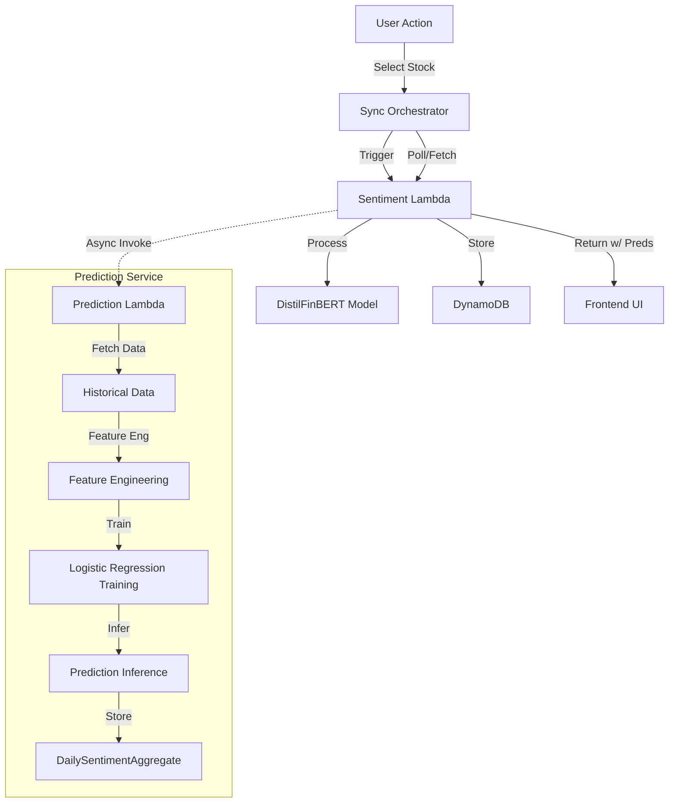

# Multi-Signal Stock Prediction System Architecture

## Overview

The Multi-Signal Stock Prediction System is a machine learning pipeline integrated into the AWS Lambda backend. It replaces the legacy bag-of-words prediction model with a sophisticated logistic regression model that combines multiple data signals to predict stock price movements across three time horizons (1-day, 2-week, 1-month).

## Architecture

The system follows a serverless, event-driven architecture:



### Key Components

1.  **Sentiment Lambda (`SentimentFunction`)**:
    *   Orchestrates the pipeline.
    *   Performs sentiment analysis using DistilFinBERT.
    *   Calculates Aspect Scores and Event Types.
    *   Triggers the Prediction Lambda asynchronously if new data is available (Smart Refresh).

2.  **Prediction Lambda (`PredictionFunction`)**:
    *   Fetches historical OHLCV and sentiment data.
    *   Trains a logistic regression model on-the-fly using TensorFlow.js.
    *   Generates predictions for 1-day, 2-week, and 1-month horizons.
    *   Persists predictions to `DailySentimentAggregate` table in DynamoDB.

3.  **DynamoDB Storage**:
    *   `StockHistoricalData`: Shared cache of price history.
    *   `ArticleAnalysisData`: Per-article sentiment and event data.
    *   `DailySentimentAggregate`: Daily aggregated signals and predictions.

## Feature Engineering

The model uses **14 features** to make predictions:

1.  **Price Features (5)**: Open, High, Low, Close, Volume (normalized).
2.  **Event Features (6)**: Weighted counts of event types:
    *   EARNINGS
    *   M&A
    *   GUIDANCE
    *   ANALYST_RATING
    *   PRODUCT_LAUNCH
    *   GENERAL
3.  **Sentiment Features (2)**:
    *   `aspect_score`: Weighted average of aspect-based sentiment.
    *   `finbert_score`: Weighted average of DistilFinBERT sentiment.
4.  **Horizon Feature (1)**: The target prediction horizon (1, 14, or 30 days).

### Materiality Weighting

Features are aggregated from article level to daily level using **Materiality Scores**:
$$ DailyFeature = \frac{\sum (Feature_i \times Materiality_i)}{\sum Materiality_i} $$

This ensures that high-impact news (e.g., Earnings) has more influence on the daily signal than low-impact news.

## Model Training

*   **Algorithm**: Logistic Regression (Binary Classification: Up/Down).
*   **Library**: TensorFlow.js (`@tensorflow/tfjs-node`) running on Node.js Lambda.
*   **Training Data**:
    *   Historical data (minimum 30 days, up to 90 days).
    *   Labels: Same-day price movement (Close vs Previous Close).
    *   Threshold: ±1% change required to be labeled 1 (Up) or 0 (Down). Small moves are treated as noise and excluded.
*   **Strategy**: On-the-fly training per ticker.
    *   Pros: Adapts to specific stock volatility and recent trends.
    *   Cons: Compute cost per request (mitigated by Smart Refresh).

## Smart Refresh Logic

To minimize compute costs and latency, the prediction pipeline uses "Smart Refresh":

1.  **Check**: When sentiment analysis completes, the system checks the `DailySentimentAggregate` table.
2.  **Compare**: It compares the date of the latest prediction against the date of the latest available news article.
3.  **Decide**:
    *   If `LatestArticle > LatestPrediction`: **Trigger Prediction**.
    *   If `No Prediction Exists`: **Trigger Prediction**.
    *   Otherwise: **Skip Prediction** (return existing cached prediction).

## API Contract

### Request (Internal Invocation)
```json
{
  "ticker": "AAPL",
  "days": 90
}
```

### Response / Storage Schema (`DailySentimentAggregate`)
```typescript
interface DailySentimentAggregateItem {
  ticker: string;
  date: string; // YYYY-MM-DD
  // ... sentiment fields ...
  nextDayDirection?: 'up' | 'down';
  nextDayProbability?: number; // 0.0 - 1.0
  twoWeekDirection?: 'up' | 'down';
  twoWeekProbability?: number;
  oneMonthDirection?: 'up' | 'down';
  oneMonthProbability?: number;
}
```

## Performance

*   **Training Time**: ~500ms - 2s (depending on history length).
*   **Inference Time**: < 50ms.
*   **Cold Start**: ~2-3s (loading TensorFlow.js).
*   **E2E Latency**: User sees cached predictions immediately (<100ms). Fresh predictions appear after background sync (~5-10s).

## Future Optimizations

1.  **Async Polling**: Implement frontend polling for long-running training jobs if history > 90 days.
2.  **Model Caching**: Serialize and cache trained TensorFlow models in S3/DynamoDB to avoid retraining if only 1 new day of data arrives.
3.  **Batch Predictions**: Predict for entire portfolio in a single batch operation.
4.  **Feature Importance**: Expose feature weights to UI to explain *why* a prediction was made (e.g., "Driven by Earnings Sentiment").
